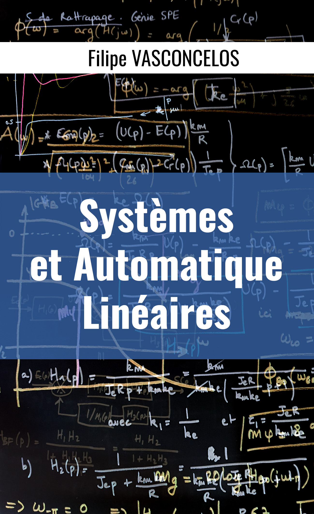

# Systèmes et automatique linéaires

## Contexte

Ce document est le résultat de l'enseignement dispensé de janvier 2018 
à juin 2022 en deuxième année de l'ESME Sudria. Celui-ci était associé 
au module de Systèmes Mécaniques et Automatiques (SMA).

## PDF (dernière version)
[PDF](sma_auto.pdf)

## Page de couverture (Illustration : Lorraine Bayard)
 

## Auteur
Filipe Manuel Vasconcelos (Enseignant à ESME Lille)
